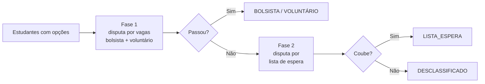
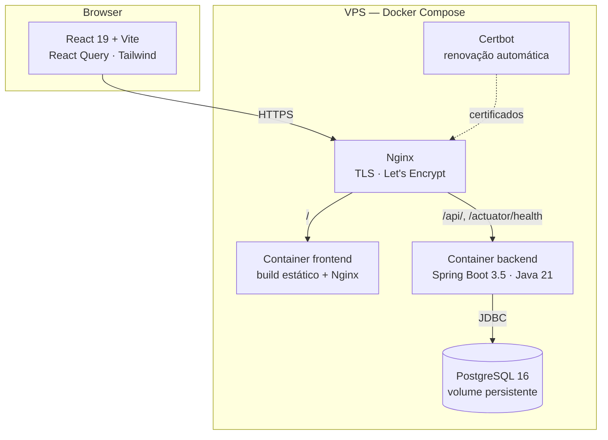
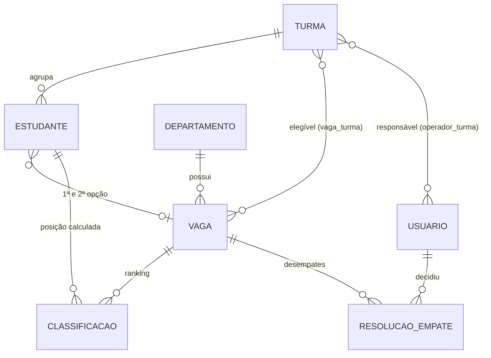

# SISUMONI

**Sistema de classificação para o processo seletivo de monitoria** — automatiza o
ranqueamento de estudantes em vagas de monitoria, substituindo uma semana de
planilhas e conferência manual por um recálculo automático a cada alteração.

[](https://github.com/M4th3us78/SISUMONI/actions/workflows/ci.yml)
[](LICENSE)
[](https://openjdk.org/projects/jdk/21/)
[](https://spring.io/projects/spring-boot)
[](https://react.dev/)
[](https://www.postgresql.org/)

> **Status:** desenvolvido entre abril e agosto de 2026 e usado em produção pelo K0
> durante o processo seletivo de monitoria. O período de funcionamento se encerrou e a
> instância de produção foi desligada — o repositório fica público como registro do
> projeto entregue, pronto para subir de novo a cada novo processo seletivo seguindo
> o [guia de deploy](docs/DEPLOY.md).

---

## O problema

No início de cada período, o K0 (Centro Acadêmico de Medicina) classifica cerca de
**130 estudantes** nas vagas de monitoria abertas pelo edital da universidade. Até
então o processo era manual: cada mudança de nota, cada desistência e cada empate
obrigava a refazer as listas à mão — **uma semana inteira de trabalho** por período,
com risco alto de erro e sem rastro de como cada posição foi decidida.

O SISUMONI recebe os dados dos estudantes e devolve a classificação final de todas as
vagas, respeitando ordem de opção, capacidade de bolsistas/voluntários, lista de
espera e desempates decididos pelos operadores.

> O sistema **informa as posições**. Fila de espera, convocação e desistência
> continuam sendo conduzidas pela universidade.

---

## O que já está pronto

Dos requisitos funcionais especificados em [`docs/REQUISITOS.md`](docs/REQUISITOS.md),
**14 dos 15 foram implementados e usados em produção** — todos os de prioridade alta
e média:

| ID | Requisito | Status |
| --- | --- | --- |
| RF001 | CRUD de estudantes, com operador restrito às suas turmas | ✅ |
| RF002 | CRUD de turmas (admin), bloqueando exclusão com estudantes vinculados | ✅ |
| RF003 | CRUD de departamentos (admin), bloqueando exclusão com vagas vinculadas | ✅ |
| RF004 | CRUD de vagas com bolsistas, voluntários, lista de espera e turmas elegíveis | ✅ |
| RF005 | CRUD de operadores, com desativação e reativação de conta | ✅ |
| RF006 | Login por e-mail e senha (JWT) | ✅ |
| RF007 | Administrador principal criado automaticamente no primeiro boot | ✅ |
| RF008 | Recuperação de senha por e-mail *(prioridade baixa)* | ⏳ [pendente](#roadmap) |
| RF009 | Recálculo automático da classificação a cada mudança de estudante | ✅ |
| RF010 | Relatórios PDF: nomes fantasia (todos) e nomes reais (somente admin) | ✅ |
| RF011 | Relatórios agrupados por departamento, com tipo de vaga e lista de espera | ✅ |
| RF012 | Alerta de empate + resolução pelo operador, com recálculo subsequente | ✅ |
| RF013 | Administrador visualiza todos os estudantes e classificações | ✅ |
| RF014 | Operador visualiza apenas estudantes das suas turmas | ✅ |
| RF015 | Operador vê todas as vagas e classificações, mesmo de outras turmas | ✅ |

**Além do escopo original**, entregue a pedido dos usuários durante o uso real do
sistema pelo K0:

- Troca obrigatória de senha no primeiro login (senha provisória).
- Bloqueio global de novos cadastros de estudantes ao fechar o período.
- Alerta de choque de horário por vaga.
- Exclusão definitiva de contas inativas.
- Vagas não preenchidas explicitadas nos relatórios.
- Tema claro/escuro.

### Roadmap

- **RF008 — recuperação de senha por e-mail.** Único requisito em aberto (prioridade
  baixa no levantamento). A infraestrutura já existe — tabela `token_recuperacao` no
  schema e SMTP parametrizado por `SPRING_MAIL_*` — e hoje o fluxo é resolvido pelo
  administrador, que redefine a senha do operador; ela entra como provisória e é
  trocada no login seguinte.

---

## O algoritmo de classificação

O núcleo do sistema é o recálculo global em
[`ClassificacaoService`](backend/src/main/java/br/com/sisumoni/backend/service/ClassificacaoService.java),
uma implementação de **aceitação diferida (Gale–Shapley)** com os estudantes propondo.

Dentro de uma vaga a disputa é **só por pontuação** (`IRA + média da opção`, 4 casas
decimais). A ordem de opção só decide *em qual* vaga o estudante fica quando ele teria
nota para passar em mais de uma — liberando a outra para o próximo colocado.

O cálculo se decompõe em duas fases sequenciais, porque a prioridade
*Passando > Lista de Espera* é igual para todos:



Em cada fase, o estudante propõe à vaga da 1ª opção e depois à da 2ª; a vaga reordena
por pontuação e devolve à fila quem não couber na capacidade — **inclusive quem já
estava dentro**, se aparecer um proponente melhor. É isso que evita o bug clássico da
abordagem ingênua: um candidato de 1ª opção com nota menor travando a vaga antes de um
candidato de 2ª opção com nota maior ser considerado.

Empates entre estudantes são detectados e sinalizados aos operadores das turmas
envolvidas; a decisão é persistida (`resolucao_empate`) e passa a ser respeitada em
todos os recálculos seguintes. Resoluções que deixam de fazer sentido após mudanças
nos dados são descartadas automaticamente.

---

## Arquitetura



- **Autenticação**: JWT stateless (`JwtFilter`), senhas com BCrypt.
- **Autorização em duas camadas**: `@PreAuthorize("hasRole('ADMIN')")` nos endpoints
  administrativos e filtro por turma dentro dos services, para que um operador não
  alcance dados de turmas que não são dele (RNF002).
- **Schema versionado** com Flyway (9 migrations), com `ddl-auto: validate` — o
  Hibernate nunca altera o banco, e o boot falha se schema e entidades divergirem.
- **Limites de memória** por container somando ~1,15 GB, para caber numa VPS de 2 GB
  (restrição de orçamento do projeto).

### Modelo de dados



---

## Stack

| Camada | Tecnologias |
| --- | --- |
| Backend | Java 21, Spring Boot 3.5 (Web, Data JPA, Security, Validation, Actuator), JJWT, OpenPDF, Lombok |
| Banco | PostgreSQL 16, Flyway |
| Frontend | React 19, Vite 8, React Router 7, TanStack Query 5, Axios, Tailwind CSS 4 |
| Infra | Docker, Docker Compose, Nginx, Certbot/Let's Encrypt |
| CI | GitHub Actions (build, testes com Postgres real, lint, build das imagens) |

---

## Rodando localmente

**Pré-requisitos:** JDK 21+, Node 20+, Docker.

```bash
git clone https://github.com/M4th3us78/SISUMONI.git
cd SISUMONI

# 1. Banco de dados (Postgres em container)
docker compose -f docker-compose.dev.yml up -d

# 2. Backend — http://localhost:8080
cd backend && ./mvnw spring-boot:run

# 3. Frontend — http://localhost:5173
cd frontend && npm install && npm run dev
```

O Flyway cria o schema no primeiro boot e o `AdminSeeder` cria o administrador inicial
com as credenciais de desenvolvimento do `application.yaml`
(`admin@sisumoni.com` / `Admin@2026!`).

> ⚠️ Esses valores são **padrões de desenvolvimento, públicos neste repositório**.
> Em produção eles são obrigatoriamente sobrescritos por variáveis de ambiente
> (`ADMIN_EMAIL`, `ADMIN_SENHA`, `JWT_SECRET`) — veja
> [`.env.production.example`](.env.production.example).

### Comandos úteis

```bash
cd backend  && ./mvnw verify      # build + testes (precisa do Postgres no ar)
cd frontend && npm run lint       # ESLint
cd frontend && npm run build      # build de produção
```

---

## API

Todos os endpoints exigem `Authorization: Bearer <token>`, exceto `/api/auth/login` e
`/actuator/health`.

| Método | Rota | Perfil | Descrição |
| --- | --- | --- | --- |
| `POST` | `/api/auth/login` | público | Autentica e devolve o JWT |
| `PUT` | `/api/auth/senha` | autenticado | Troca a própria senha |
| `GET` `POST` `PUT` `DELETE` | `/api/estudantes` | admin · operador (só suas turmas) | CRUD de estudantes |
| `GET` `POST` `DELETE` | `/api/turmas` | leitura: todos · escrita: admin | CRUD de turmas |
| `GET` `POST` `DELETE` | `/api/departamentos` | leitura: todos · escrita: admin | CRUD de departamentos |
| `GET` `POST` `PUT` `DELETE` | `/api/vagas` | leitura: todos · escrita: admin | CRUD de vagas |
| `GET` | `/api/vagas/{id}/classificacao` | autenticado | Classificação calculada da vaga |
| `POST` | `/api/vagas/{id}/resolver-empate` | autenticado | Registra o desempate e recalcula |
| `GET` `POST` `PUT` `DELETE` | `/api/operadores` | admin | CRUD, desativação e reativação |
| `DELETE` | `/api/operadores/{id}/definitivo` | admin | Exclusão definitiva de conta inativa |
| `GET` | `/api/configuracoes` | autenticado | Configuração global do sistema |
| `PUT` | `/api/configuracoes/cadastro-estudante` | admin | Abre/fecha cadastros de estudantes |
| `GET` | `/api/relatorios/classificacao/nomes-fantasia` | autenticado | PDF com nomes fantasia |
| `GET` | `/api/relatorios/classificacao/nomes-reais` | admin | PDF com nomes reais |
| `GET` | `/actuator/health` | público | Healthcheck |

Erros seguem um formato único (`ErroResponse`), produzido por um
`@RestControllerAdvice` global.

---

## Qualidade

O [pipeline de CI](.github/workflows/ci.yml) roda a cada push e pull request em
`main` e `development`:

1. **Backend** — `./mvnw verify` contra um **PostgreSQL 16 real** subido como service
   container. O contexto Spring só inicia se as 9 migrations do Flyway aplicarem num
   banco vazio e o schema validar contra as entidades JPA.
2. **Frontend** — `npm ci`, ESLint sem erros e build de produção.
3. **Docker** — build das duas imagens multi-stage usadas em produção, garantindo que
   o deploy continua reproduzível.

### Segurança

- Nenhum segredo no repositório: `.env*` é ignorado pelo Git e todo valor sensível
  entra por variável de ambiente, com `.env.production.example` como referência.
- Senhas com BCrypt; sessões stateless com JWT assinado por segredo de ≥32 bytes.
- Senha provisória força troca no primeiro acesso.
- HTTPS obrigatório em produção (redirect 301 em HTTP), TLS 1.2/1.3.
- CORS restrito por lista de origens (`CORS_ALLOWED_ORIGINS`), sem curinga — em
  produção front e API ficam sob o mesmo domínio, então nada é cross-origin.
- Actuator expõe **apenas** `/health`, sem detalhes.

---

## Estrutura do repositório

```
SISUMONI/
├── backend/                 # Spring Boot — 58 arquivos Java
│   └── src/main/
│       ├── java/br/com/sisumoni/backend/
│       │   ├── config/          # SecurityConfig, JwtFilter
│       │   ├── controller/      # 8 controllers REST
│       │   ├── domain/          # 8 entidades JPA
│       │   ├── dto/             # 15 DTOs de request/response
│       │   ├── exception/       # Handler global de erros
│       │   ├── repository/      # Repositórios Spring Data
│       │   └── service/         # Regras de negócio e classificação
│       └── resources/
│           ├── db/migration/    # 9 migrations Flyway
│           └── relatorio/       # Assets dos PDFs
├── frontend/                # React + Vite — 7 páginas
│   └── src/{pages,components,contexts,hooks,lib}
├── nginx/                   # Configs de bootstrap (HTTP) e final (HTTPS)
├── docs/
│   ├── DEPLOY.md            # Deploy na VPS, passo a passo, com Let's Encrypt
│   └── REQUISITOS.md        # Levantamento de requisitos, stakeholders, glossário
├── docker-compose.dev.yml   # Só o Postgres, para desenvolvimento
└── docker-compose.prod.yml  # Stack completa: db, backend, frontend, nginx, certbot
```

---

## Deploy

O guia completo de produção — VPS, domínio, emissão e renovação do certificado
Let's Encrypt, bootstrap HTTP → HTTPS e atualização — está em
**[`docs/DEPLOY.md`](docs/DEPLOY.md)**.

Resumo:

```bash
cp .env.production.example .env.production   # preencha os segredos
ln -s .env.production .env
docker compose -f docker-compose.prod.yml build
docker compose -f docker-compose.prod.yml up -d
```

---

## Licença

Distribuído sob a licença MIT — veja [`LICENSE`](LICENSE).
